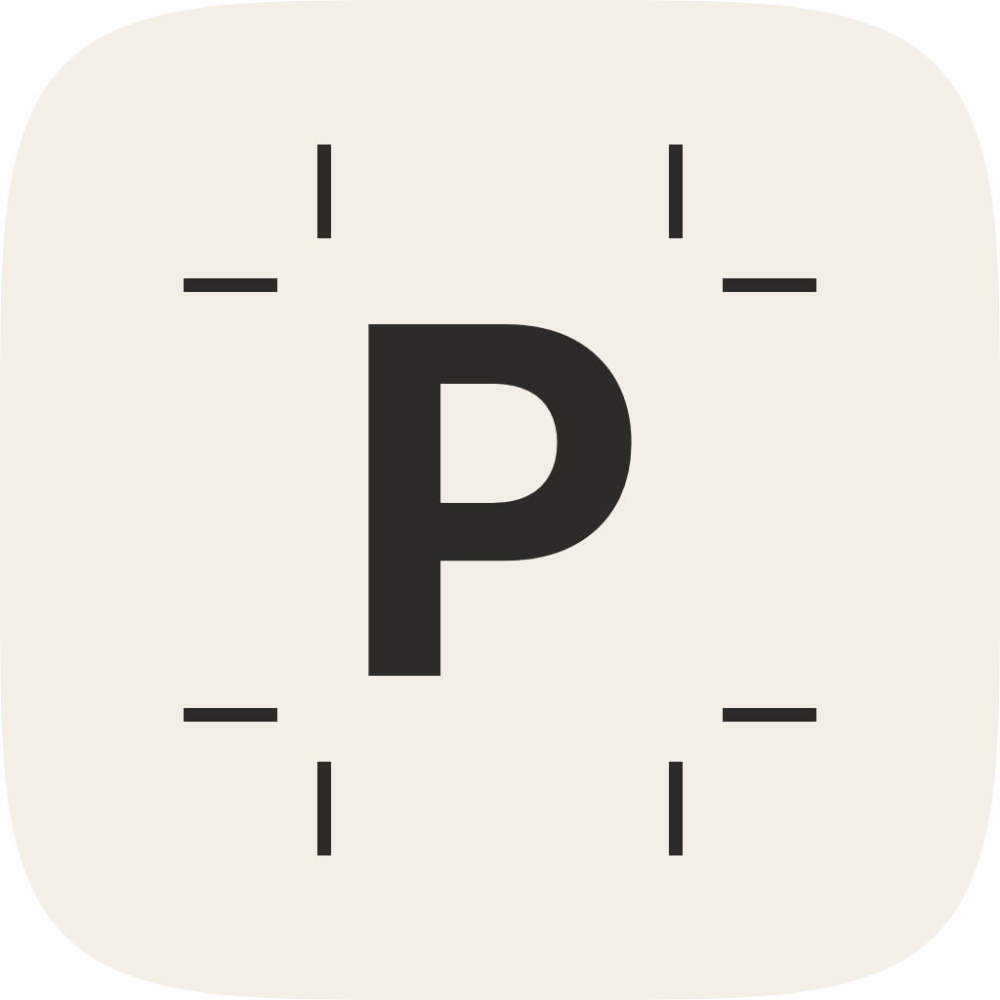

# Print Kit



Print Kit is a Figma plugin that prepares print-ready PDFs on your own computer. It builds print pages with bleed and crop marks, checks them for print problems, maps colors to pure black, fixed CMYK values or spot colors, and converts to CMYK with Ghostscript. Unlike Print for Figma and Printery, it never uploads your designs.

## In short

- Create print pages in common formats, or turn existing frames into print pages, with bleed, safe area and crop marks.
- Check pages for blurry images, small text, hairlines, missing fonts and artwork that stops at the edge, with one-click fixes.
- Export CMYK PDFs for coated (FOGRA39) or uncoated (FOGRA47) paper, with pure black text, spot colors, exact trim and bleed boxes and smooth vector gradients.
- The interface follows Figma's own UI3 and speaks English, German, Spanish and French.

## Install

Development plugins only run in the Figma desktop app.

1. In this folder, run `npm install` and then `npm run build`.
2. Open the Figma desktop app and any design file.
3. Choose Plugins, Development, Import plugin from manifest, and pick `manifest.json` from this folder.
4. Run it from Plugins, Development, Print Kit. Its submenu also opens a tab directly.

## Use

| Tab | What it does |
|---|---|
| Create | New pages from a format tile, or Selected frames: each frame gets a print copy, and selected print pages are updated in place. A live diagram shows page, bleed, safe area and crop marks |
| Check | Runs when the tab opens. Results come by page and topic, each with why it matters and how to fix it. Thin lines and rectangles that stop at the edge have a fix button |
| Colors | Lists the colors when the tab opens. Black prints as pure K, rich black for large areas, or by profile. Each color converts automatically, gets fixed CMYK values, or becomes a spot color. Preview print colors shows how each will print and flags big shifts |
| Export | Lists the pages with previews; untick or drag to reorder. Offset print, Digital print and RGB proof set the options, More options shows each. Checks for errors first |

Shortcuts and details:

- Enter runs the tab's main button. In a field, Enter only confirms the value. Cmd or Ctrl with Enter confirms and runs at once.
- Fields take units: `3mm`, `0.125in`, `1/8"`, `1cm`. Arrow keys step, with Shift ten times.
- Switching between mm and inches lands on common values, so 3 mm becomes 0.125 in.
- Fixed CMYK fields take a pasted `0/100/100/0` or `C0 M100 Y100 K0`.
- Spot names complete as you type: `hks 13` offers HKS 13 K, N, E and Z, `485` offers PANTONE 485 C and U, and `ral 3020` becomes RAL 3020.
- The window grows with its content up to the size you drag the corner to.
- The menu next to the tabs switches the language and shows the introduction again.

What counts as a page:

- A selected frame, or the frame around a selected layer.
- The frames inside a selected section.
- With nothing selected, every print page on the current Figma page.
- Print pages from Print for Figma and Printery are recognized by their trim slice.

Nothing runs in the background. Check and Colors run when their tab opens, a changed selection only marks results as outdated, and the color engine loads only for the print preview or an export.

## Print profiles

| Profile | Use for |
|---|---|
| Coated FOGRA39 | Gloss and matte coated paper, the most common European condition |
| Uncoated FOGRA47 | Uncoated offset paper |
| Your ICC file | Whatever your print shop names, for example PSO Coated v3 (FOGRA51) |

Ask the print shop which one they want. The built-in profiles come from the colord project, made with ArgyllCMS from Fogra's characterization data with a 300 % ink limit, and are CC0. ECI's own profiles, such as PSO Coated v3, may not be redistributed, so they load as files.

Print Kit ships no Pantone, HKS or RAL color values. Those libraries are licensed, and print shops match spot colors by name. The CMYK fallback of a spot color comes from the profile unless you set it.

## How the export works

1. The check runs on the chosen pages. Errors stop the export once, until Export anyway.
2. Figma renders each page with its own PDF export, in RGB.
3. The pages are merged with pdf-lib.
4. For CMYK, Print Kit rewrites the solid colors you mapped: black to K 100, large black areas to C60 M40 Y40 K100 if you chose rich black, chosen colors to fixed CMYK or spot colors, and overprint where set. Crop marks become the registration color, so they print on every plate.
5. Gradients are converted next. Ghostscript would turn RGB gradients into low-resolution images, so Print Kit samples them, converts those colors with the profile in one Ghostscript run, and writes each gradient back as a vector in CMYK or gray.
6. Ghostscript 10.06, compiled to WebAssembly, converts everything else with the chosen profile and reduces images if asked.
7. pdf-lib sets the MediaBox, CropBox, TrimBox and BleedBox, the output intent with its registered condition such as FOGRA39, and the title.
8. The browser saves the PDF, or a ZIP with one PDF per page.

## Privacy

- Pages, colors and files stay on your computer.
- The color engine (15.5 MB) downloads from `cdn.jsdelivr.net` once per plugin session, only for the print preview, CMYK, grayscale or reduced images. It runs only if its SHA-256 matches the pinned value.
- There is no analytics and no account.
- Settings and a loaded ICC profile are stored on your computer. Color choices are stored in the Figma file, so everyone who exports it gets the same colors.

## Compared with the other plugins

| Feature | Print for Figma | Printery | Print Kit |
|---|---|---|---|
| Where colors convert | Publisher's server | Publisher's server | This computer |
| Free exports | None | A few | Unlimited |
| Pure black K 100 | Pro color maps | Per color | Pure, rich for areas, or by profile |
| Spot colors and overprint | Pro | Yes | Yes, with Pantone, HKS and RAL name completion |
| TrimBox and BleedBox | Cloud path only | Yes, bleed rounded | Yes, exact |
| Output intent | PDF/X-4 on the server | Skipped by default | FOGRA39, FOGRA47 or your profile |
| Preflight | Pro | Partly stubbed | Images, text, lines, fonts, edges, safe area, with fixes |
| Languages | English | English | English, German, Spanish, French |
| Templates, facing pages, AI upscaling | Partly | Yes | Not yet |
| Analytics | Amplitude, PostHog | Microsoft Clarity | None |

## Development

| Path | Contents |
|---|---|
| `src/main/` | Figma main thread: pages, creation and updates, checks and fixes, export |
| `src/ui/app.js` | Tab bar, summary line, main action, Enter, window size, introduction |
| `src/ui/tab-*.js` | One file per tab: its summary, body and main action |
| `src/ui/dom.js` | Figma-style controls: fields, segmented controls, menus, combobox, tooltips |
| `src/ui/i18n.js` | All interface text in four languages |
| `src/ui/pipeline.js` | The export pipeline and the print preview |
| `src/ui/pdf-*.js`, `engine.js` | Color rewriter, gradients, PDF assembly, Ghostscript loader |
| `src/ui/profiles/` | The two built-in ICC profiles |
| `src/shared/print.js` | Units, formats, page geometry, crop marks, PDF boxes, image resolution |
| `check.mjs` | Tests the geometry, color codes and the whole PDF pipeline with the real Ghostscript build |
| `test/harness.html` | Hosts the built UI like Figma does, with a fake main thread |
| `docs/cover.html`, `docs/listing.md` | The Community cover (rendered to `cover.png`) and the publish dialog texts |
| `docs/icon.svg` | The icon; `icon.png` is 1024 px, `icon-128.png` is the size Figma's publish dialog asks for |

Commands:

```sh
npm run build
npm run check
npm run typecheck
python3 -m http.server 8765 --bind 127.0.0.1
```

With the server running, open `http://127.0.0.1:8765/test/harness.html`. Add `?dark`, `?lang=de`, `?tab=colors`, `?welcome` or `?gradient` to try a theme, a language, a start tab, the introduction or the gradient fixture.

## Limits

- Images always convert with the profile. Solid colors and gradient stops can be mapped; a gradient can't become a spot color.
- Rich black goes by shape size: Figma writes text as outlines, so very large headlines over 25 mm can print rich too.
- Print Kit sets an output intent but doesn't claim PDF/X conformance.
- Bleed and margins are the same on all sides.
- Facing pages, templates and AI upscaling are not built yet.
- Figma rasterizes some effects, such as shadows and blurs, in its PDF export.

## License

AGPL-3.0-or-later, because Print Kit runs Ghostscript, which is licensed under the AGPL. pdf-lib and fflate are MIT licensed. Inter is under the SIL Open Font License 1.1. The FOGRA39 and FOGRA47 profiles are colord's CC0 profiles.
